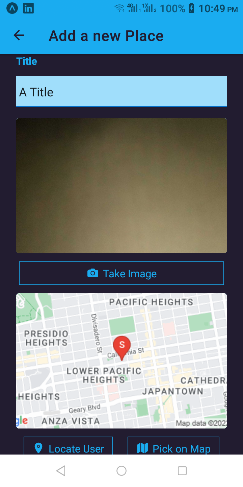

# Favorite Places App (using react-native)

An app project for a favorite places app using react-native framework

## Screenshots

<div align="left">
    
    
    
    
    
    
</div>

## Environment Variables

```sh
GOOGLE_MAPS_API_KEY
```

## Installed Packages

```sh
yarn add @react-navigation/native @react-navigation/native-stack

yarn expo install react-native-screens react-native-safe-area-context

yarn expo install expo-image-picker

yarn expo install expo-location

yarn add --dev react-native-dotenv

yarn expo install react-native-maps

yarn expo install expo-sqlite

yarn expo install expo-splash-screen
```

## Notes

- An Environment variable cannot be used directly form from imports. It needs to be assigned to a variable in the needed file. Otherwise, it will throw an error
